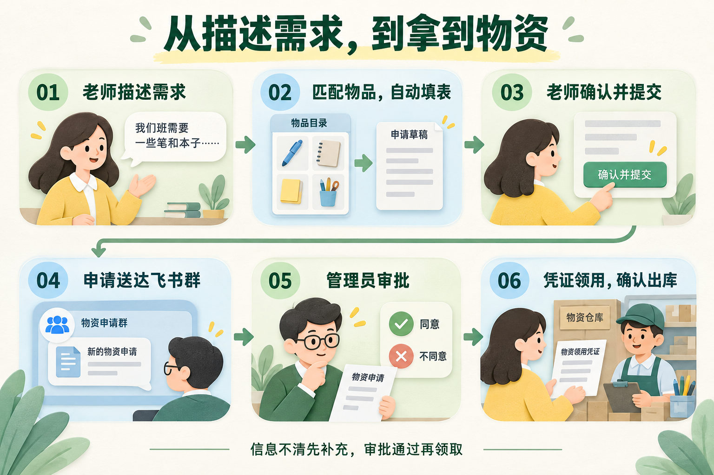
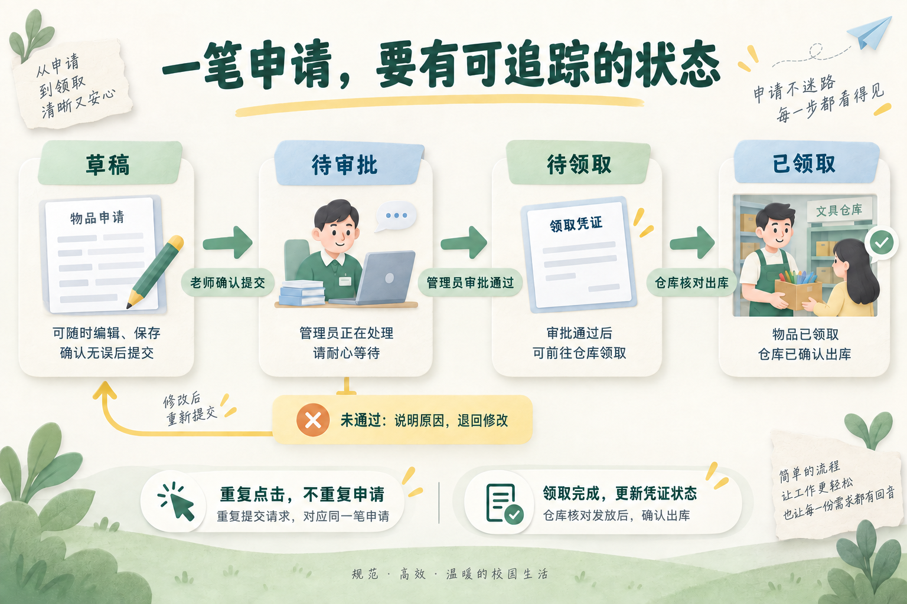

# AI 物资申领助手，怎样才算把事情办完？

“明天下午公开课，要一个翻页用的遥控器。”

老师说完这句话，AI 提取出时间、物品和数量，再返回几行结构化字段。模型的任务似乎完成了，但老师接下来还要找物品名称、填申请表、发给管理员、等审批。

这也是我重新思考物资申领助手这个小项目时，想往前推进的一步：让老师确认需求后，申请就能进入实际的办理流程。

我想把它设计成这样的使用过程：自然语言描述需求，系统匹配物品并自动填表；老师确认后，一键提交到飞书群，由仓库管理员审批；审批通过，老师拿着领用凭证去领取物资。

这条流程也提供了一个设计 AI 产品的方法：先确定事情怎样才算办完，再安排模型、程序和人各自负责什么。

## 一、先把老师和管理员放进同一条流程

老师关心的是，需要的物资能不能按时领到。仓库管理员则需要知道谁申请、领什么、多少、哪天用，以及这笔申请是否符合领用规则。

如果只给老师生成一张表，后面的沟通仍然要靠他自己完成。申请发到了哪里、管理员有没有看到、审批通过后凭什么领取，都没有被解决。

所以，在这套设计里，老师确认申请后，系统应把申请单提交到指定的飞书群，并交给对应的仓库管理员处理。管理员看到的申请卡片里，要有足够的信息直接作出判断。

这里的“一键”有两个明确的动作：老师确认后提交，管理员核对后审批。老师确认自己要什么，管理员决定这笔申请能否通过。

通过后，系统把审批结果和领用凭证返回给老师，显示申请编号、已批准的物品及数量、领取地点等信息。老师凭这笔申请去领取，仓库核对并确认出库，申请状态才变为“已领取”。

审批通过只能说明可以领，物资实际交到老师手里，才是这笔申领的终点。

## 二、自然语言要变成仓库里真正存在的物品

把“翻页用的遥控器”原样填进申请表，管理员可能还要重新问一遍。自动填表之前，系统需要把老师的描述与物资目录对上。

例如，目录里如果有“无线翻页笔”，系统可以把它作为候选物品，带出名称、规格、计量单位和物品编号，让老师核对。

这一环节需要配合完成：模型理解老师在描述什么，系统查询现行物资目录，再根据候选结果生成申请草稿。

遇到多个相近物品，要把差异展示出来。比如同类设备有不同接口，老师的一句话不足以区分，就让他选一下。没有找到匹配物品，也要明确提示，不能生成一个仓库里不存在的名称。

数量和时间同样如此。“领点纸”缺少明确数量，“下周要用”没有确定日期，这些都应该在提交前补充。页面可以只突出待确认的部分，让老师少找、少改。

模型微调的价值，需要在这里具体判断：它能否更稳定地理解口语、识别申领意图、提取规格和数量，或处理容易混淆的描述？

物品目录、实时库存和管理员信息仍应从业务数据中读取。目录更新时改数据，比让模型重新记住一批名称更便于维护。群内提交和审批按钮，也需要系统接入相应功能。

## 三、设计完整流程，先回答四个问题

### 第一，用户确认之后，还需要自己做什么？

我会从老师点击确认后的动作开始检查。

如果老师点了确认，还要复制申请内容、找到群聊、重新发给管理员，那么系统只完成了前半段。

在新的设计里，老师点击“确认并提交”后，系统负责保存申请、投递到指定群，并显示“待审批”。点击成功、申请已保存、管理员已收到，需要按实际结果区分，不能只弹一句“提交成功”就结束。

这样，老师才知道下一步是等待审批，还是需要重新处理提交失败。

### 第二，哪些信息需要模型理解，哪些必须查询或校验？

口语中的物品描述需要理解，目录里的物品编号需要查询；“明天”需要结合提交日期换算，申请人身份可以从账号获取。

明确规则能处理的部分，交给程序。模型提取出的字段则保留原文依据，尤其要检查是否擅自补了日期、数量或规格。

至于理解这一步是否需要微调，我会先用现有模型加提示词做一个基础版本。只有出现持续、明确的短板，或者有经过验证的成本收益，才考虑增加训练。

让流程更完整，与是否微调，是两项需要分别验证的决定。

### 第三，哪些动作可以自动执行，哪些需要人确认？

查询目录、填写已确认的字段、把申请交给指定管理员，可以按预先设计的流程执行。

改变老师要领的物品、增加数量、替换规格，则应该重新请老师确认。管理员可以一键通过信息完整、符合规则的申请；不通过时，也要给出原因或退回补充。

库存不足需要单独处理。例如在审批时提示当前可用数量，由管理员决定退回、部分批准或建议替代物品。涉及改变原需求的结果，应让老师知道并确认。

这条申领路径的主要步骤可以提前确定，先用固定工作流就能组织起来。只有在后续需要动态处理大量不同分支时，再评估是否需要 Agent。

### 第四，减少了谁的操作，是否把麻烦转给了另一个人？

老师少填几个字段，是一个收益。但如果管理员收到更多名称不清、数量不明的申请，就得花更多时间追问。

因此，我会同时看两边：老师完成申请用了多久、修改了几次；管理员是否能直接审批、平均需要补问几轮。

审批之后，还要看老师能否顺利找到领取地点，仓库能否快速核对凭证，是否出现重复提交或重复领取。

只有这些环节一起看，才能判断自动化有没有真正减少工作量。

## 四、用一笔申请检查整个产品

验证这个助手时，我会让一笔申请从头走到尾，而不只检查模型生成的几行文字。

先从老师的自然语言开始，看系统能否匹配正确物品；再检查确认后的申请，是否准确出现在管理员面前；管理员审批后，老师看到的领用信息是否一致；最后确认领取动作能否对应到同一笔申请。

还要故意放入几种不顺利的情况：物品有多个候选、数量没说清、库存不足、群消息发送失败、老师连续点击两次提交。

这些情况不必都靠模型解决。重复点击应对应同一笔申请，发送失败应能重试并避免重复投递，已经领取的凭证应有明确状态。流程能解释发生了什么，用户才知道如何继续。

如果还要验证微调的收益，就把其他环节保持一致，比较不同模型在理解和提取这一步的表现，避免把新增提交、审批功能带来的便利都算成模型能力提升。

这个物资申领助手要把一笔申请送到管理员手里，并让老师知道何时、凭什么去领。自然语言降低了老师表达需求的门槛，后面的系统设计则决定，这句话能否真正变成仓库管理员可以办理的事情。
